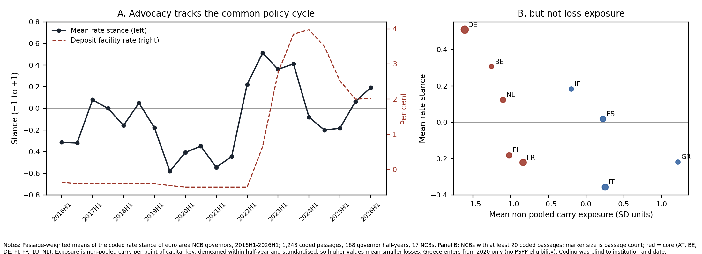
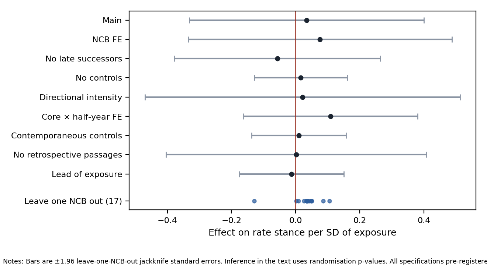
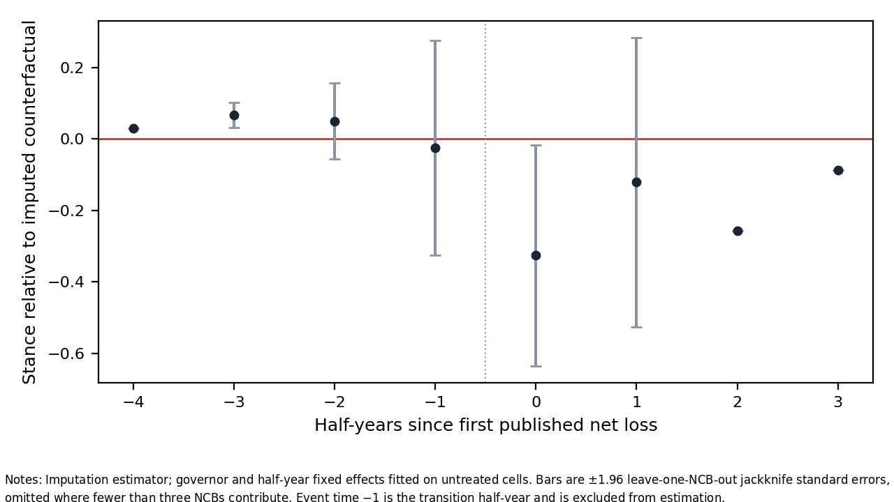

# Do Central Bank Losses Move Policymakers?

## Pre-Registered Evidence from the Eurosystem

**Philip Kroos — September 2026**

[**Read the paper (PDF)**](paper/main.pdf) · [**Replication guide**](README_REPLICATION.md) · [**Pre-registration & amendments**](docs/)

---

## Abstract

Since 2022, many euro-area national central banks have recorded large losses on bond portfolios accumulated under quantitative easing while funding costs rose with policy rates. This paper asks whether those losses affect the publicly stated interest-rate preferences of the governors who sit on the ECB Governing Council.

The Eurosystem provides an unusual setting: a common monetary policy is decided by one committee, but its national central banks hold separate balance sheets. Income from sovereign bonds purchased under the PSPP and PEPP is largely neither risk-shared nor income-shared, generating substantial cross-country variation in non-pooled carry exposure.

I code **1,991 passages** from speeches by euro-area NCB governors between 2016 and 2026 into a rate-stance measure and relate advocacy to each institution's non-pooled carry exposure in a design registered in advance. The main estimate is close to zero and imprecise: **0.034 stance points per standard deviation of exposure** (95% CI **−0.33 to 0.40**, permutation *p* = **0.81**). Equivalence tests exclude effects larger than about **0.34 stance points**, but smaller effects remain possible.

The results suggest that publicly stated rate preferences are dominated by a **common policy cycle and persistent individual differences**, with no detectable response to the finances of a governor's own institution.

---

## Main finding

> **Central-bank loss exposure does not detectably move individual rate advocacy.**

| Quantity | Estimate |
|---|---:|
| Baseline effect | **0.034** |
| Standard error | 0.187 |
| 95% confidence interval | [−0.33, 0.40] |
| Permutation *p*-value | 0.81 |
| Smallest equivalence bound rejected at 5% | ±0.34 |

The coefficient has the predicted sign, but its magnitude is small relative to persistent differences in stated preferences across governors and national central banks.



*Figure 1. Rate advocacy follows the common monetary-policy cycle, but average advocacy does not line up with non-pooled carry exposure.*

---

## Research design

The analysis combines institutional variation in national central-bank balance sheets with a blinded text-as-data measure of monetary-policy preferences.

- **Outcome:** governor-level rate advocacy coded from public speeches on a −1 to +1 scale.
- **Unit:** governor × half-year, 2016H1–2026H1.
- **Exposure:** NCB-specific non-pooled sovereign-bond carry per percentage point of Eurosystem capital key.
- **Specification:** governor fixed effects and half-year fixed effects, with pre-period fiscal controls interacted with the policy rate.
- **Inference:** permutation of complete NCB exposure paths using a leave-one-NCB-out jackknife-studentised statistic.
- **Secondary design:** event study around the first published net loss.
- **Pre-registration:** outcome, design, controls, inference and interpretation rules were frozen before the stance passages were read or linked to institutions and dates.

The identifying comparison is within governors over time and across NCBs whose own bond holdings per unit of capital key generate different carry losses when policy rates rise.

---

## Robustness

The null result is stable across the pre-specified analysis set.



*Figure 2. Estimated effects across the main specification and pre-specified robustness checks. The estimates remain close to zero across alternative fixed effects, controls, outcome definitions and leave-one-NCB-out specifications.*

Across the twelve pre-specified exposure constructions, the baseline estimate lies between **0.033 and 0.046**. Across the broader robustness set, estimates remain small, and dropping each NCB in turn moves the estimate between roughly **−0.13 and +0.11**.

The published-loss event design points in the hypothesised direction but is underpowered and statistically indistinguishable from placebo timing.



*Figure 3. Event-time estimates around the first published net loss. The short-run decline is suggestive, but the number of treated institutions is small and permutation inference does not reject the null.*

---

## What the data say about monetary-policy preferences

A central descriptive result is that the bulk of variation in advocacy is not time-varying national exposure:

- governor fixed effects alone explain about **49%** of the weighted variance in the stance measure;
- half-year fixed effects alone explain about **42%**;
- together they explain about **84%**.

This leaves relatively little variation for changing national conditions such as central-bank losses, sovereign spreads or debt exposure.

---

## Data and measurement

The speech corpus comes from the BIS full-text archive. Speeches are split into five-sentence passages, institutional and geographic identifiers are masked, and relevant passages are coded blind to institution and date.

Of **1,991 filtered passages**, **1,248** state a view on the policy rate and enter the governor-half-year panel, covering **31 governors and 17 NCBs**.

The exposure measure is constructed from ECB purchase data, national sovereign yields, the Eurosystem capital key and the relevant reference rate. The repository also contains the hand-collected record of published NCB losses, provisions and distributions used for the secondary design.

### Measurement limitation

The final passages were coded in a single blinded language-model pass under the frozen codebook. No independent human validation sample was ultimately completed, so the paper does not report human-model agreement statistics or an estimate of filter recall. This is treated explicitly as the main measurement limitation.

---

## Repository structure

```text
.
├── paper/                 PDF, LaTeX source, bibliography and figures
├── code/                  Corpus, classification, exposure and estimation code
├── data/                  Hand-collected and derived analysis inputs
├── output/                Frozen coding labels and final analysis outputs
├── power/                 Ex-ante power and sensitivity calculations
├── model/                 Numerical and symbolic model verification
├── docs/                  Pre-registration, amendments, codebook and hashes
├── tests/                 Unit and pipeline tests
├── README_REPLICATION.md  Detailed replication instructions
├── requirements.txt       Python dependencies
└── CITATION.cff           Citation metadata
```

---

## Reproduction

The analysis was developed under **Python 3.12.3**.

```bash
python -m pip install -r requirements.txt
python -m pytest -q -p no:debugging tests
```

See [**README_REPLICATION.md**](README_REPLICATION.md) for the full replication workflow and [**docs/data_download.md**](docs/data_download.md) for external-source data instructions.

The complete BIS speech archive is not redistributed in this repository.

---

## Pre-registration and transparency

The analysis plan and four subsequent amendments are stored in [`docs/`](docs/) together with SHA-256 hashes. The repository also records deviations from the frozen plan and contains the coded passages used in the final estimation.

This structure is intended to separate decisions made **before** outcome inspection from later robustness and interpretation.

---

## Paper

**Kroos, Philip (2026).**  
*Do Central Bank Losses Move Policymakers? Pre-Registered Evidence from the Eurosystem.*  
Draft, 15 September 2026.

[**Download the full paper**](paper/main.pdf)

---

## Citation

If you use the paper or replication package, please cite:

```bibtex
@unpublished{kroos2026centralbanklosses,
  author = {Kroos, Philip},
  title  = {Do Central Bank Losses Move Policymakers? Pre-Registered Evidence from the Eurosystem},
  year   = {2026},
  note   = {Draft, 15 September 2026}
}
```
